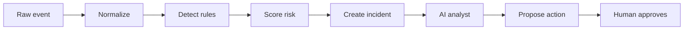

# AutoSIEM tutorial (start here)

You don't need SIEM experience to follow this. It assumes roughly Security+ level
familiarity: you know what logs are, what a firewall is, and what phishing is.
Everything below runs on your laptop with zero cloud services.

Estimated time: ~20 minutes to finish all 5 steps.

## 1. What a SIEM does (2 minutes)

A SIEM (Security Information and Event Management) does four jobs:

1. **Collect** — pull logs from everywhere: servers, firewalls, cloud, apps.
2. **Normalize** — turn a thousand different log formats into one common shape,
   so "failed login" from Windows, Linux, and Okta all look the same.
3. **Detect** — compare normalized events against rules. A rule says "if you see
   this pattern, raise a finding."
4. **Respond** — group findings into incidents, tell an analyst what happened,
   and propose actions (with approval, not silently).

AutoSIEM implements all four as a small Python program you can run and read
end to end. It is built around the same standards the big vendors use (see
section 6), so the concepts transfer directly to Splunk, Sentinel, or Elastic.

## 2. The pipeline (3 minutes)

Every event AutoSIEM processes flows through this path:



| Stage | What happens | Where in the code |
|---|---|---|
| Ingest | Raw JSONL/syslog-ish lines arrive | `autosiem.normalization` |
| Normalize | Fields are mapped to the common event shape (`category`, `action`, `user`, `host`, `src_ip`, ...) | `autosiem.normalization` |
| Detect | Every enabled rule is checked against each event | `autosiem.detection` |
| Risk | Entities (users, hosts, IPs) accumulate risk points | `autosiem.risk` |
| Incident | Findings cluster into one incident per rule + entity | `autosiem.storage` |
| AI analyst | A deterministic local investigator (or your LLM) writes a narrative and proposes actions | `autosiem.soc_runtime`, `autosiem.llm` |
| Approve | High-impact actions stay gated behind `approve` — nothing runs silently | `autosiem.policy` |

Normalization is what makes SIEMs powerful: your rules are written against the
normalized fields, so one rule detects the same attack from any log source.

## 3. Run it end to end (5 minutes)

From the repository root:

```bash
# 1. Run the demo: processes built-in events, detects, scores, investigates
PYTHONPATH=src python3 -m autosiem.cli demo --db data/autosiem.db
```

That one command should print events, findings, an incident, and an AI
investigation report. Then look at the results:

```bash
# 2. See the incident queue
PYTHONPATH=src python3 -m autosiem.cli incidents --db data/autosiem.db

# 3. Open one incident (find its id in the previous output)
PYTHONPATH=src python3 -m autosiem.cli incident --id <incident-id> --db data/autosiem.db

# 4. See every normalized event
PYTHONPATH=src python3 -m autosiem.cli events --db data/autosiem.db

# 5. See the audit log (every decision is recorded)
PYTHONPATH=src python3 -m autosiem.cli audit --db data/autosiem.db
```

You just ran a complete SIEM pipeline: collect → normalize → detect → risk →
incident → AI analysis → audited decision.

## 4. Load your own events (5 minutes)

Events are JSON lines (`jsonl`): one JSON object per line. Look at
`examples/events.jsonl`:

```bash
cat examples/events.jsonl
```

Each line is a raw event. The normalizer maps common field names into the
canonical shape, so you can feed it anything with a `category`, `action`,
`user`, `host`, `src_ip`, and `outcome`. Process the example file:

```bash
PYTHONPATH=src python3 -m autosiem.cli ingest --file examples/events.jsonl --db data/autosiem.db
```

Inspect what landed:

```bash
PYTHONPATH=src python3 -m autosiem.cli findings --db data/autosiem.db
```

The `ingest` command accepts one file at a time. For continuous collection,
see the API ingest endpoint in section 7 — it accepts NDJSON over HTTP, so any
log shipper (or a cron job, or a custom script) can push events to AutoSIEM.

Continuous options shipped in the MVP: `cli listen` opens a UDP syslog
(RFC 5424/3164) + CEF listener you can point rsyslog/syslog-ng at, and
`cli poll` tails JSONL files via the connector SDK (log-rotation safe). See
`docs/deployment-and-collection.md` for forwarder configs.

## 5. Write a detection rule (5 minutes)

Rules live in `rules/`. They are loaded at ingest/demo time — add a file and
re-run, no restart needed.

### JSON rules

`rules/failed_login.json` is a good template. A rule has an `id`, a
`selection` (field → expected value), and a `mitre_attack` tag:

```json
{
  "id": "AUTH-BF-001",
  "name": "Repeated failed logins",
  "severity": "medium",
  "risk_points": 50,
  "selection": { "category": "authentication", "action": "login_failed" },
  "mitre_attack": ["T1110"]
}
```

`selection` supports a rich match language: plain equality, list membership,
`contains`, `contains_any`, `startswith`/`endswith` (plus `startswith_any`/
`endswith_any`), `regex`, `in`, `not_in`, `not_equals`, and `exists`.

### Sigma rules

Sigma is the open detection-rule standard used across the industry — rules
written in Sigma can be shared between SIEMs. AutoSIEM imports a practical
subset of Sigma YAML directly. Drop a `.yaml` file into `rules/` and it is
converted automatically.

`rules/encoded_powershell.yaml` is a real example. Read it — it detects
PowerShell launched with `-enc`/`-encodedcommand` (T1059.001) and filters out
benign tooling:

```yaml
detection:
  selection:
    Image|endswith:
      - '\powershell.exe'
      - '\pwsh.exe'
    CommandLine|contains:
      - '-enc'
      - '-encodedcommand'
    CommandLine|contains: 'IEX'
  condition: selection and not filter
  filter:
    CommandLine|contains:
      - 'AzureAD'
      - 'ModuleAnalyzer'
level: high
tags:
  - attack.execution
  - attack.t1059.001
  - attack.t1027
```

Test it: the rule fires on the PowerShell event in `examples/events.jsonl`
(`powershell -enc SQBFAFgA`) and stays quiet on a plain `notepad.exe` event.

Exporting works too: `cli export` writes one `.yaml` per rule so you can share
them with other Sigma-compatible tools:

```bash
PYTHONPATH=src python3 -m autosiem.cli export --rules rules --out-dir /tmp/sigma-rules
```

## 6. Standards you're using (2 minutes)

| Standard | What it is | How AutoSIEM uses it |
|---|---|---|
| OCSF (Open Cybersecurity Schema Framework) | Linux Foundation's vendor-neutral event schema — the common "shape" for security events | Normalized events use OCSF-inspired fields (`category`, `action`, `actor`, `src_endpoint`, ...) |
| MITRE ATT&CK | Public knowledge base of adversary tactics & techniques (`Txxxx` IDs, e.g. T1059.001) | Rules carry `mitre_attack` tags; `coverage` reports which techniques you can detect |
| Sigma | Open rule format for writing detections once and sharing them | `rules/*.yaml` are imported automatically and can be exported back via `cli export` |

Check your detection coverage against a watchlist of high-value techniques:

```bash
PYTHONPATH=src python3 -m autosiem.cli coverage --rules rules
```

The output lists the techniques you cover and the gaps. The gap list is your
to-do: each uncovered technique is a rule you could write next.

The bundled rules already exercise a full attack kill-chain on the example
profile `alice` (risk 1000, critical, AI proposes containment):

| Stage | Rule | Technique(s) |
|---|---|---|
| Phishing email delivered | `AUTO-EMAIL-001` | T1566 |
| Successful remote login | `AUTO-CRED-001` | T1078 |
| Failed login attempts | `AUTO-AUTH-001` | T1110 |
| Encoded PowerShell | `AUTO-EXEC-001` + `SIG-EXEC-001` | T1059.001, T1027 |
| Download cradle | `AUTO-EXEC-002` | T1059 |
| System recon | `AUTO-DISCO-001` | T1082 |
| Masqueraded system process | `AUTO-DEFEV-001` | T1036 |
| Mimikatz credential dump | `AUTO-CRED-002` | T1003 |
| Lateral movement (wmic) | `AUTO-LAT-001` | T1021 |
| Web exploit attempt | `AUTO-WEB-001` | T1190 |
| Encrypted C2 tunnel | `AUTO-C2-001` | T1573 |
| Data exfiltration | `AUTO-EXFIL-001` | T1041 |
| Log clearing | `AUTO-DEFEV-002` | T1070 |
| Ransomware encryption | `AUTO-IMPACT-001` | T1486 |
| Cloud admin role assumed | `AUTO-CLOUD-001` | T1078, T1078.004, T1098 |

## 7. Dashboard and API (3 minutes)

The web UI shows the incident queue, incident detail with timeline, proposal
decisions, and suppression management:

```bash
./scripts/run_dashboard.sh
```

Then open `http://127.0.0.1:8000/` (incident queue) and
`http://127.0.0.1:8000/docs` (API reference).

The API is also the machine-to-machine ingest path. With the server running:

```bash
# Push the example events over HTTP (ndjson body)
curl -X POST http://127.0.0.1:8000/api/ingest \
  -H 'content-type: application/x-ndjson' \
  --data-binary @examples/events.jsonl
```

Optional: set `AUTOSIEM_INGEST_TOKEN` when starting the server and every
ingest call must send it as `x-api-key` or a `Bearer` token — this is how you
lock the ingest port down in production (TLS is handled by putting a reverse
proxy like Caddy/nginx in front).

## 8. The AI runtime and safety (2 minutes)

Out of the box the "AI analyst" is a deterministic local investigator — no
network calls, no API keys. It reads the incident's events and writes a
narrative, proposes decisions, and suggests actions. By default, high-impact
actions (disable user, isolate host, block IP) are **proposed, not executed**:

```bash
PYTHONPATH=src python3 -m autosiem.cli incidents --db data/autosiem.db   # find a proposal id
PYTHONPATH=src python3 -m autosiem.cli approve --proposal-id <id> --db data/autosiem.db
```

Every approval/rejection is in the audit log. To bring in a real LLM (Ollama,
LM Studio, or any OpenAI-compatible server), set `AUTOSIEM_LLM_URL` and pass
`--llm`; secrets are redacted before leaving the process and the pipeline
falls back to the local investigator if the model is unavailable. See the
README's LLM section and `docs/ai-soc-runtime.md`.

## 9. What's next

- `docs/architecture.md` — how the pieces fit together
- `docs/siem-research-2026.md` — the 2026 SIEM landscape research this product is based on
- `docs/product-vision-ai-soc.md` — the end-state product vision
- `docs/roadmap.md` — what is done and what is planned (connectors, streaming, scale)
- `docs/deployment-and-collection.md` — how real deployments get data in

**One next action:** run `PYTHONPATH=src python3 -m autosiem.cli demo --db data/autosiem.db`
and then `PYTHONPATH=src python3 -m autosiem.cli coverage --rules rules`. You've
now run a full SIEM pipeline and seen exactly which attacks you can detect.
